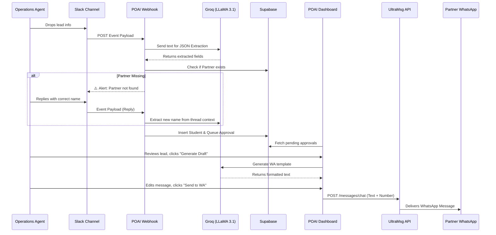

# Product Requirements Document (PRD): POAI (Partnerships Operations AI)

## 1. Introduction & Background
POAI was conceived to streamline the partnership operations team's workflow. The core problem was that agents were manually copying student lead data from Slack channels, formatting WhatsApp messages, and sending them to partner agencies. This manual process was slow, prone to errors, and difficult to track.

### 1.1 Original Problem Statement
Build an AI Slack bot that automatically listens to partnership leads dropped in Slack, instantly drafts a WhatsApp message, and either sends it directly to the partner or replies in the Slack thread for an agent to approve and send.

### 1.2 Evolved Architecture (The Changes)
During development, the architecture evolved to provide better visibility, security, and scalability for the operations team:
1. **Centralized Dashboard over Slack UI:** Instead of forcing agents to manage approvals via clunky Slack buttons, we built a dedicated web dashboard (Next.js). This allows agents to edit messages, manage partner mappings, and view all pending tasks in a unified interface.
2. **Dedicated Mappings System:** To ensure messages reach the correct destination, a `Mappings` interface was built to link custom Partner Names (extracted from Slack) directly to WhatsApp phone numbers (for individuals) or Group IDs (for agencies).
3. **Smart Error Handling via Slack:** If the AI extracts a lead but the partner is not registered in the Mappings database, the system halts and pings the agent back in the Slack thread. When the agent replies to correct the partner name, the system stitches the context together and silently resolves the error.
4. **Third-Party WhatsApp Delivery:** Instead of the official (and expensive) WhatsApp Cloud API, the system uses **UltraMsg**, which links to a standard WhatsApp Web session to deliver messages from an internal company number.

---

## 2. Scope & Objectives

### 2.1 In Scope
- **Slack Eavesdropping:** A webhook endpoint that listens for message events in designated Slack channels.
- **AI Data Extraction:** Using an LLM (Groq LLaMA 3.1) to intelligently extract fields (`prospect_id`, `student_name`, `partner_name`, `status`, `notes`) from unstructured conversational text.
- **Dashboard Management:** A web interface for agents to view extracted leads, generate AI drafts, manually edit messages, and approve them for dispatch.
- **Partner Mapping:** CRUD operations to manage partner names and their associated WhatsApp destination numbers/links.
- **WhatsApp Dispatch:** Direct integration with UltraMsg API to send approved text drafts instantly to WhatsApp.

### 2.2 Out of Scope
- Direct two-way messaging (receiving replies from Partners on WhatsApp back into the POAI Dashboard).
- Automatic message sending without human approval (all messages must pass through the Dashboard Queue).
- CRM Integration (e.g., Salesforce, Hubspot). The system relies purely on the provided Slack text and prospect IDs.

---

## 3. End-to-End Workflow

1. **Trigger:** An operations agent drops a message in the designated Slack channel (e.g., `amberstudent.com/dashboard/leads/879965 Partner: Leap Scholar. Counselor told him to book after visa`).
2. **Ingestion:** The Slack Event API pushes the message payload to the Next.js `POST /api/webhooks/slack` route.
3. **Extraction & Validation:** 
   - The webhook parses the text using the Groq LLM.
   - It queries the Supabase `partners` table.
   - **Error Path:** If the partner doesn't exist, it replies in the Slack thread asking for clarification.
4. **Queueing:** If valid, the system inserts the lead into the `students` table, links the Slack context in `slack_threads`, and creates a `pending` task in the `approvals` table.
5. **Dashboard Review:** The agent logs into the POAI Next.js dashboard and views the Approval Queue.
6. **Drafting:** The agent clicks "Generate AI Draft" (or types manually). The AI formats the text into a clean WhatsApp template.
7. **Dispatch:** The agent clicks "Send to WA". The dashboard calls the UltraMsg API, passing the `whatsapp_number` mapped to that partner, and the message is instantly delivered to the partner's phone.

---

## 4. System Architecture Diagram

---

## 5. Technical Constraints & Decisions

### 5.1 Technology Stack
- **Framework:** Next.js 14+ (App Router) for both the frontend dashboard and backend API endpoints.
- **Database:** Supabase (PostgreSQL) for relational data mapping (`partners`, `students`, `approvals`, `slack_threads`).
- **AI Model:** Groq (LLaMA-3.1-8b-instant). Chosen for its near-zero latency, which is critical for synchronous Slack webhook acknowledgements (Slack requires a response within 3 seconds).
- **Messaging Provider:** UltraMsg API. Chosen because it mimics WhatsApp Web, avoiding the strict template approvals, 24-hour windows, and high costs of the official Meta Cloud API.

### 5.2 Security Constraints
- **Slack Verification:** The webhook uses `x-slack-signature` and `x-slack-request-timestamp` with HMAC SHA256 to verify payloads originate from Slack.
- **Vercel Edge Functions:** Due to Vercel's serverless architecture, long-running tasks are tricky. We optimized the Groq calls to resolve quickly to prevent serverless function timeouts.

### 5.3 Data Constraints
- **Phone Number Formatting:** UltraMsg requires phone numbers to be stripped of the `+` prefix (e.g., `919876543210`). The dashboard handles this sanitization prior to dispatch.
- **Thread Tracking:** The system relies on `slack_thread_ts` to prevent duplicate lead processing and to properly stitch conversation contexts together for error resolution.
