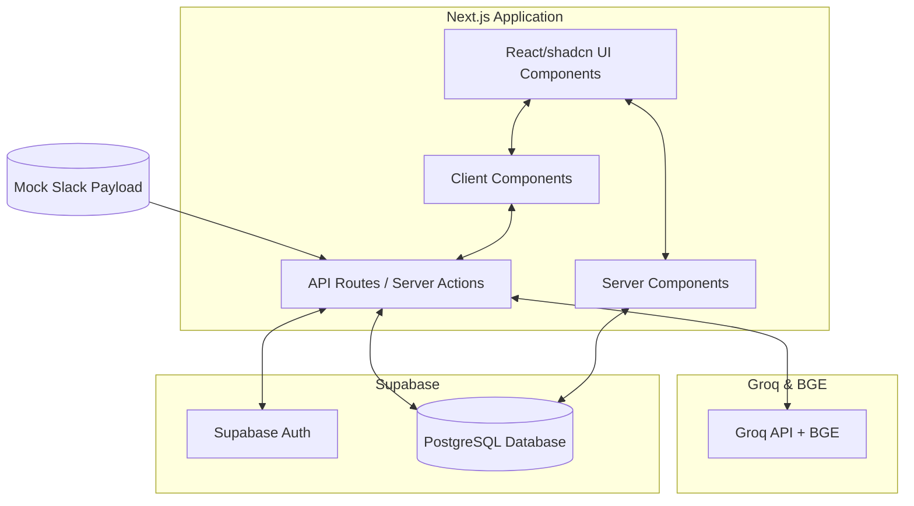

# POAI System Architecture

## 1. System Overview
The Partnership Operations AI Assistant (POAI) is a centralized, internal SaaS web application built to streamline partnership workflows. It integrates lead ingestion, AI-driven data extraction, and an automated approval queue within a modern, highly responsive dashboard.

## 2. High-Level Architecture Diagram
The architecture relies on a serverless and edge-compatible framework, separating the client UI from the backend services and AI processing engines.



## 3. Technology Stack
* **Frontend Framework**: Next.js 15 (App Router for optimized SSR and Server Actions)
* **UI/Styling**: React, Tailwind CSS, `shadcn/ui` (accessible, composable components)
* **Backend as a Service (BaaS)**: Supabase (PostgreSQL, Row Level Security, Auth)
* **AI Provider**: Groq API (for data extraction and message generation) and BGE Model (for embeddings)
* **Deployment & Hosting**: Vercel
* **Language**: TypeScript (strict mode for end-to-end type safety)

## 4. Frontend Architecture (Next.js 15)
The application will leverage the Next.js App Router (`/app` directory) for routing, data fetching, and layouts.

### Directory Structure
```
/app
  /(auth)            # Login page and auth callback
  /(dashboard)       # Protected routes (Dashboard, Leads, Queue, Log, Settings)
    layout.tsx       # Main dashboard shell (Sidebar, Header)
/components
  /ui                # shadcn/ui generic components (buttons, tables, dialogs)
  /features          # Domain-specific components (e.g., LeadTable, KPI-Cards)
/lib
  /supabase          # Supabase client initialization (browser/server)
  /utils             # Helper functions (Tailwind merges, formatting)
/types               # Global TypeScript definitions
```

### State Management & Data Fetching
* **Server Components**: Used by default to fetch data directly from Supabase securely without exposing keys or bloating the client bundle.
* **Client Components**: Used only where interactivity is required (e.g., forms, dynamic tables, modals).
* **Mutations**: Next.js Server Actions will handle form submissions, database updates (e.g., approving a message), and triggering AI workflows.

## 5. Backend & Database (Supabase)
Supabase provides the PostgreSQL database and Authentication mechanisms.

### Database Schema
The database uses standard relational tables with Foreign Key constraints.
* `users`
  * `id` (uuid, primary key, references auth.users)
  * `name` (text)
  * `email` (text)
  * `role` (text)
* `partners`
  * `id` (uuid, primary key)
  * `name` (text)
* `students`
  * `id` (uuid, primary key)
  * `prospect_id` (text, unique)
  * `name` (text)
  * `partner_id` (uuid, foreign key to partners.id)
  * `status` (text)
  * `notes` (text)
* `activities`
  * `id` (uuid, primary key)
  * `student_id` (uuid, foreign key to students.id)
  * `user_id` (uuid, foreign key to users.id)
  * `action` (text)
  * `status` (text)
  * `timestamp` (timestamptz, default now())
* `approvals`
  * `id` (uuid, primary key)
  * `student_id` (uuid, foreign key to students.id)
  * `message` (text)
  * `status` (text - pending, approved, rejected)
  * `approved_by` (uuid, foreign key to users.id)

## 6. AI Workflows
The AI integration focuses on automating manual data entry and communication drafting.

### Mock Slack Ingestion & Extraction Workflow
1. **Trigger**: An API Route (`/api/webhooks/slack`) receives a mock JSON payload representing a Slack message.
2. **Extraction**: The server invokes the Groq API (e.g., `llama3-70b-8192`) with a strict JSON schema prompt to parse the raw message into structured data (`Student Name`, `Prospect ID`, `Partner`, `Status`, `Notes`).
3. **Database Insertion**: The parsed data is inserted into the `students` table.
4. **Follow-up Generation**: A secondary prompt generates a professional follow-up message based on the extracted status and notes.
5. **Approval Queue**: The generated message is inserted into the `approvals` table with a `pending` status.
6. **Logging**: An entry is created in the `activities` table.

## 7. UI/UX Design System
Adhering to Antigravity's premium standards:
* **Color Palette**: Curated dark/light modes with vibrant accent colors (avoiding generic defaults).
* **Typography**: Modern sans-serif fonts (e.g., Inter, Outfit).
* **Micro-interactions**: Hover states, smooth page transitions, and loading skeletons to maintain a responsive feel.
* **Component Library**: Customized `shadcn/ui` components to match a bespoke, premium SaaS aesthetic.

## 8. Security & Environment variables
* Row Level Security (RLS) will be enabled on all Supabase tables to ensure users only access authorized data.
* Server Actions and API Routes will validate user sessions before executing mutations.

**Required Secrets:**
* `NEXT_PUBLIC_SUPABASE_URL`
* `NEXT_PUBLIC_SUPABASE_ANON_KEY`
* `SUPABASE_SERVICE_ROLE_KEY` (for secure backend operations)
* `GROQ_API_KEY`
